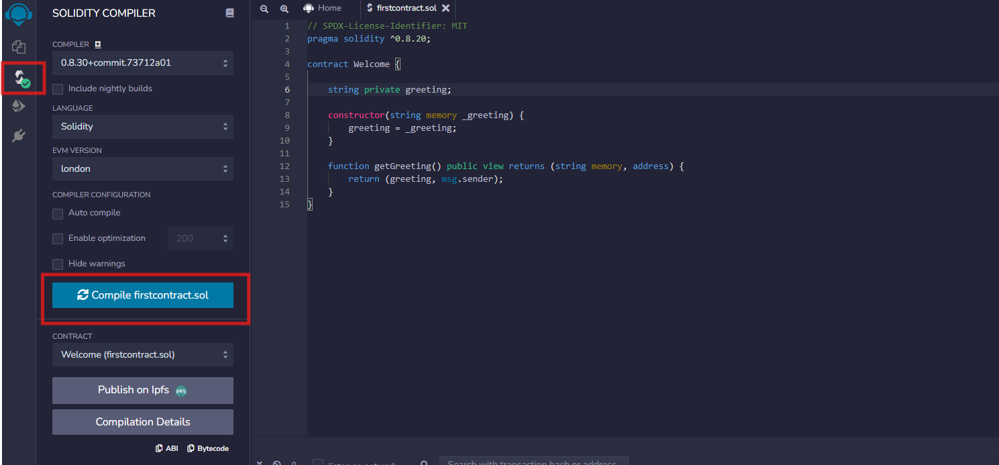
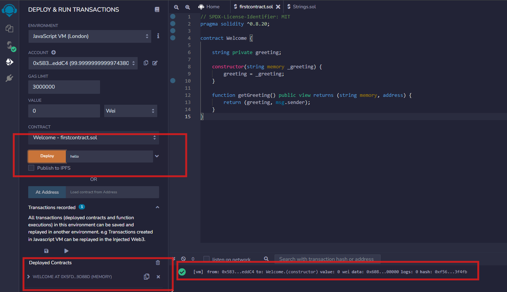
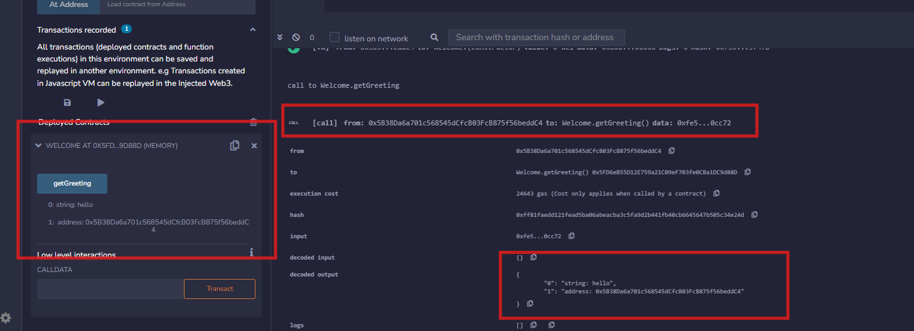

## Bài 2.3 – Viết hàm Solidity đơn giản

### 📄 Mã nguồn Solidity

```solidity
// SPDX-License-Identifier: MIT
pragma solidity ^0.8.20;

contract Welcome {
    string private greeting; 

    constructor(string memory _greeting) {
        greeting = _greeting;
    }

    function getGreeting() public view returns (string memory, address) {
        return (greeting, msg.sender);
    }
}
```

---

### ✅ Kết quả test trên Remix IDE

#### 🛠 Compile Contract

&#x20;**Ghi chú**: Biên dịch mã nguồn trên Remix IDE.

#### 🚀 Deploy Contract

&#x20;**Ghi chú**: Deploy smart contract với giá trị khởi tạo là `"hello"`.

#### 🔍 Gọi hàm `getGreeting()`

&#x20;**Ghi chú**: Kết quả trả về là một tuple gồm greeting và địa chỉ người gọi (msg.sender), ví dụ:

```text
[
  "hello",
  "sender address"
]
```

> 📌 Lưu ý: Địa chỉ ví sẽ thay đổi tùy theo tài khoản được dùng trên Remix VM hoặc MetaMask.

