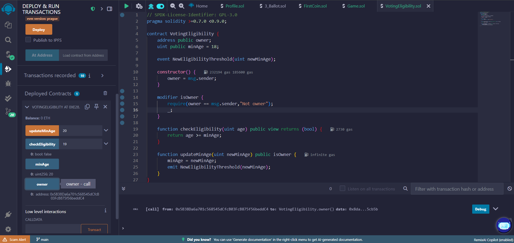
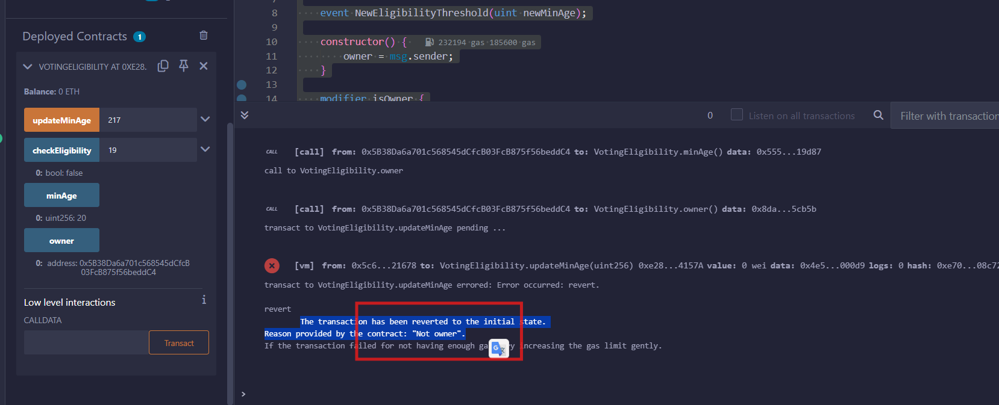

# Bài 3.2 – Hàm, Control Flow và Visibility

## ✅ Solution

```solidity
// SPDX-License-Identifier: GPL-3.0
pragma solidity >=0.7.0 <0.9.0;

contract VotingEligibility {
    address public owner; 
    uint public minAge = 18;

    event NewEligibilityThreshold(uint newMinAge);

    constructor() {
        owner = msg.sender;
    }

    modifier isOwner {
        require(owner == msg.sender,"Not owner");
        _;
    }

    function checkEligibility(uint age) public view returns (bool) {
        return age >= minAge;
    }

    function updateMinAge(uint newMinAge) public isOwner {
        minAge = newMinAge;
        emit NewEligibilityThreshold(newMinAge);
    }
}
```

## 🖼 Minh chứng triển khai trên Remix


> Đã triển khai, gọi `updateMinage(20)`, sau đó kiểm tra `checkEligibility()` và `minAge` thành công.


> Thử đổi tài khoản và gọi hàm updateMinAge -> thất bại.
