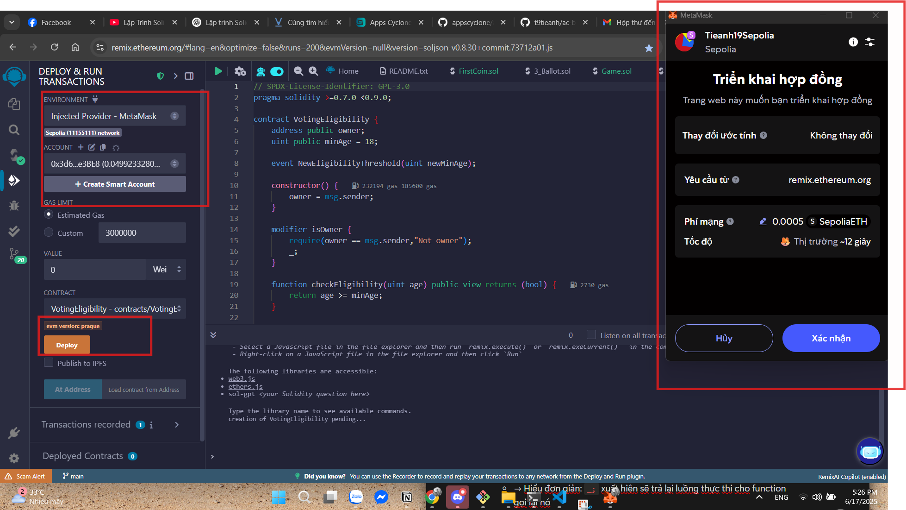
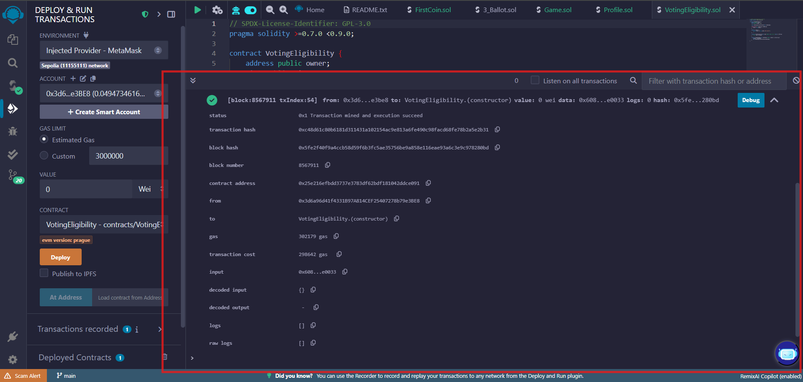
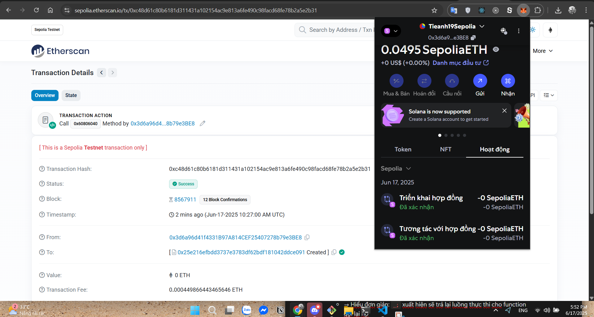
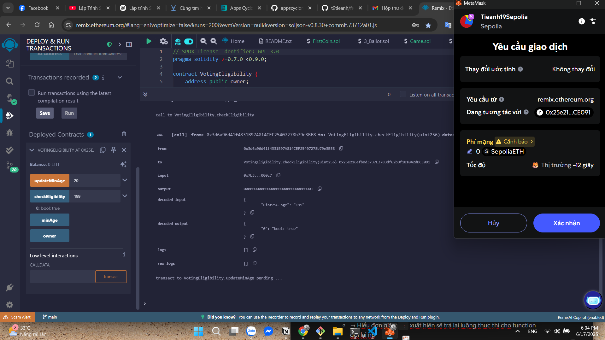
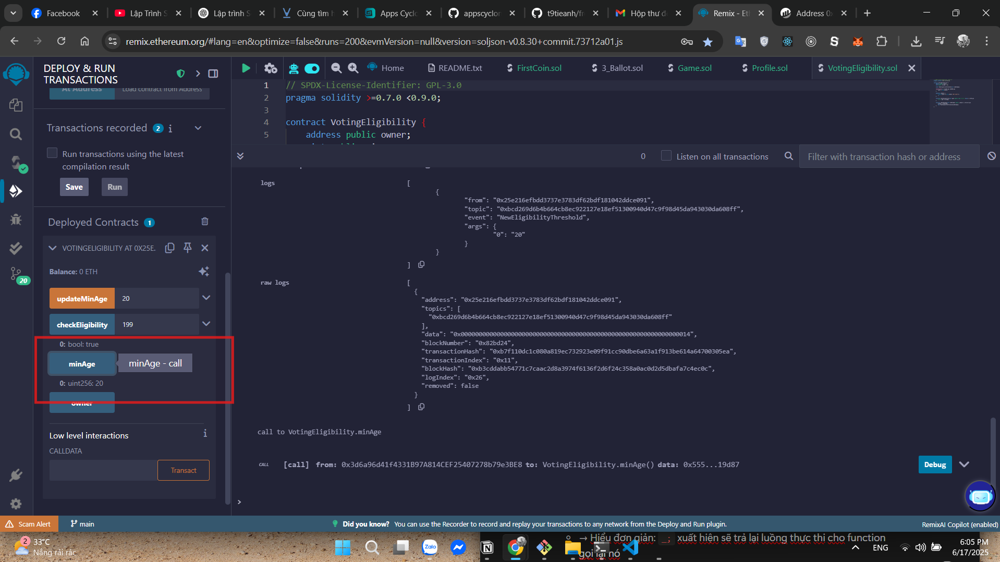
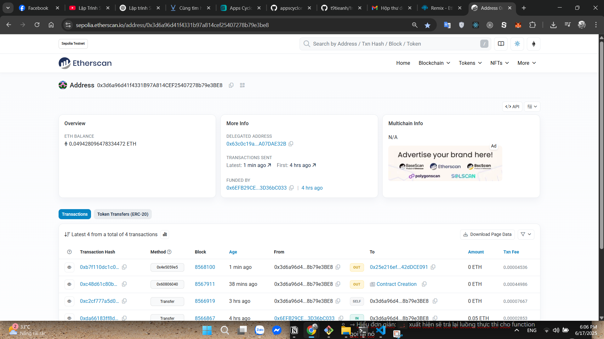
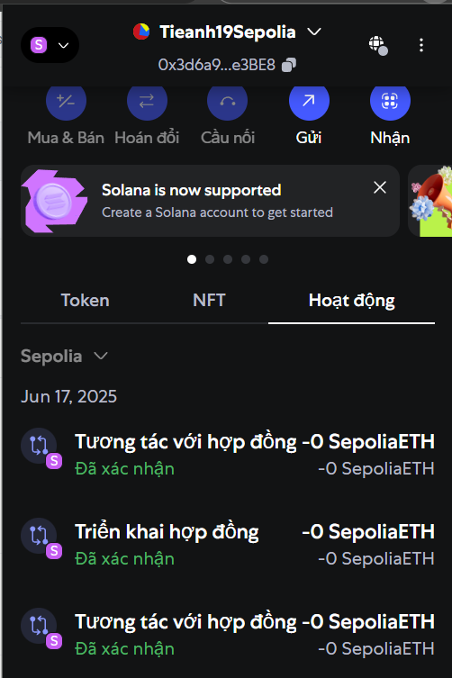

# Bài 3.3: Deploy & Debug Contract đầu tiên trên Testnet

## Deploy Contract thật

- Viết contract đơn giản `VotingEligibility.sol`, ví dụ:

  ```solidity
  pragma solidity >=0.7.0 <0.9.0;

  contract VotingEligibility {
      address public owner;
      uint public minAge = 18;
      event NewEligibilityThreshold(uint newMinAge);

      constructor() {
          owner = msg.sender;
      }

      modifier isOwner {
          require(owner == msg.sender, "Not owner");
          _;
      }

      function updateMinAge(uint _age) public isOwner {
          minAge = _age;
          emit NewEligibilityThreshold(_age);
      }

      function checkEligibility(uint age) public view returns(bool) {
          return age >= minAge;
      }
  }
  ```

- Compile và nhấn **Deploy**, MetaMask sẽ yêu cầu xác nhận giao dịch:&#x20;


📸 *Giao diện sau khi nhấn Deploy và MetaMask yêu cầu xác nhận:*


- Sau khi giao dịch được mined, Remix hiện thông tin chi tiết:&#x20;


📸 *Remix sau khi deploy thành công:*


---

## 4. Kiểm tra trên Etherscan

- Mở trang [Sepolia Etherscan](https://sepolia.etherscan.io), tìm theo transaction hash bạn có được:


📸 *Giao dịch trên Etherscan (transaction và deploy contract):*


- Ta thấy:

  - Status `Success`
  - Block number, confirmations
  - Từ ví cá nhân đến việc tạo contract
  - Gas fee dùng \~0.00044 ETH

- Ngoài ra, trên MetaMask cũng thể hiện các hoạt động như Deploy và tương tác:&#x20;

📸 *Thông tin giao dịch deploy trên MetaMask:*


---

## Debug & Gỡ lỗi

- Trên Remix, sau khi deploy contract, mục **Deployed Contracts** xuất hiện interface:&#x20;


- Gọi `updateMinAge(20)`, Remix sẽ mở MetaMask để xác nhận tương tác (transaction):&#x20;
📸 *Giao diện gọi updateMinAge(20):*



- Gọi hàm `minAge()` để verify giá trị mới (`20`):\
  👁️ Kết quả trả về `20` – contract hoạt động đúng.

---
## Lịch sử giao dịch của tài khoản




*README này đã bao gồm ảnh chụp minh chứng toàn bộ quá trình, từ kết nối ví, deploy, tương tác cho đến debug.*

