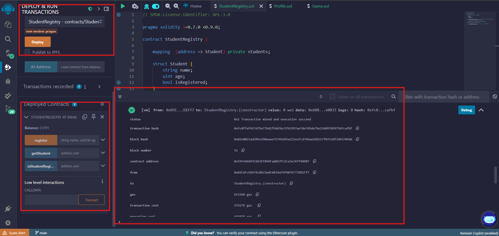
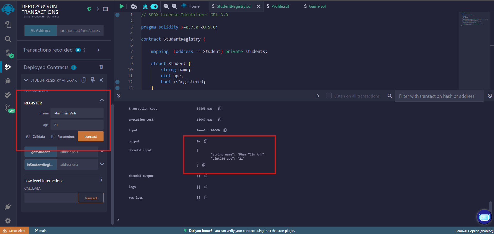
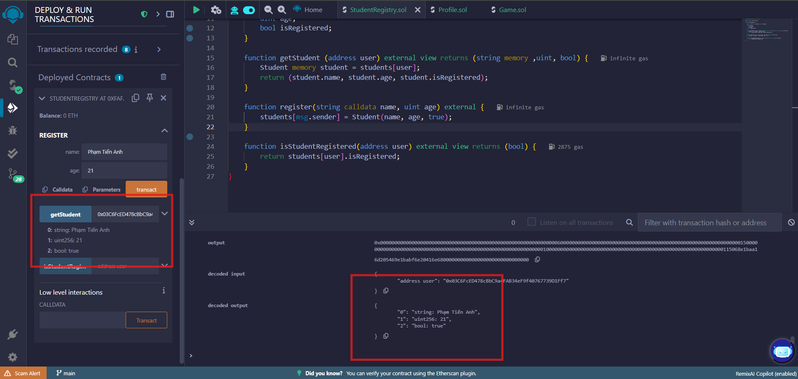
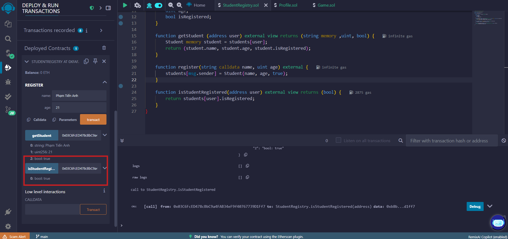

# 📘 Báo cáo Smart Contract: StudentRegistry

---

## 🧩 Phần 1 – Mã nguồn Smart Contract

```solidity
// SPDX-License-Identifier: GPL-3.0

pragma solidity >=0.7.0 <0.9.0;

contract StudentRegistry {

    mapping  (address => Student) private students;

    struct Student {
        string name;
        uint age;
        bool isRegistered;
    }

    function getStudent (address user) external view returns (string memory ,uint, bool) {
        Student memory student = students[user];
        return (student.name, student.age, student.isRegistered);
    }

    function register(string calldata name, uint age) external {
        students[msg.sender] = Student(name, age, true);
    }

    function isStudentRegistered(address user) external view returns (bool) {
        return students[user].isRegistered;
    }
}
```

---

## 📸 Phần 2 – Hình chụp minh chứng triển khai & kiểm thử

### ✅ Ảnh 1 – Triển khai contract trên Remix


### ✅ Ảnh 2 – Gọi hàm `register()`


### ✅ Ảnh 3 – Gọi hàm `getStudent()`


### ✅ Ảnh 4 – Gọi hàm `isStudentRegistered()`



---

## 📌 Ghi chú thêm

- Solidity version: `^0.8.0`
- IDE: [Remix Ethereum IDE](https://remix.ethereum.org)
- Blockchain giả lập: `JavaScript VM`
- Không yêu cầu token hoặc phí giao dịch thực tế khi test

---
