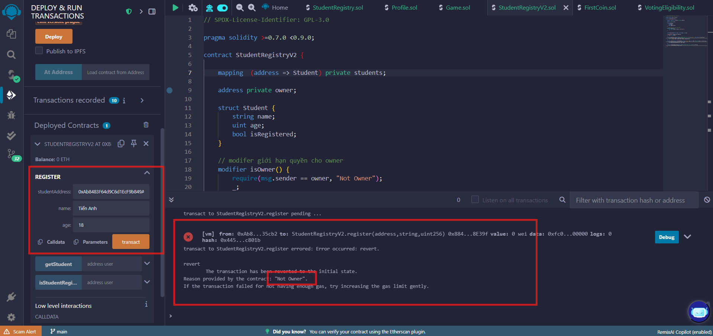

# 📘 Báo cáo bài 4.2 – Modifier, Event và Quyền Truy Cập

## 🧩 Mã nguồn Smart Contract

```solidity
// SPDX-License-Identifier: GPL-3.0

pragma solidity >=0.7.0 <0.9.0;

contract StudentRegistryV2 {

    mapping  (address => Student) private students;

    address private owner;

    struct Student {
        string name;
        uint age;
        bool isRegistered;
    }

    // modifer giới hạn quyền cho owner
    modifier isOwner() {
        require(msg.sender == owner, "Not Owner");
        _;
    }

    
    event Registered(address user, string name, uint age);

    constructor() {
        owner = msg.sender;
    }

    function getStudent (address user) external view returns (string memory , uint, bool) {
        Student memory student = students[user];
        return (student.name, student.age, student.isRegistered);
    }

    function register(address studentAddress, string calldata name, uint age) external isOwner {
        students[studentAddress] = Student(name, age, true);
        emit Registered(studentAddress, name, age);
    }

    function isStudentRegistered(address user) external view returns (bool) {
        return students[user].isRegistered;
    }
}
```

---

## 📸 Phần 2 – Hình chụp minh chứng triển khai & kiểm thử

### ✅ Ảnh 1 – Gọi hàm register bằng một tài khoản khác (Không phải tài khoản deploy)


### ✅ Ảnh 2 – Gọi hàm `register()` thành công !

