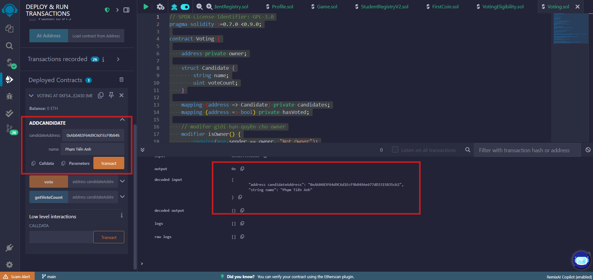
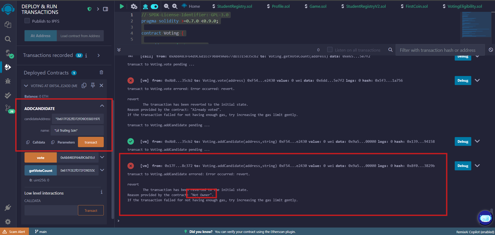
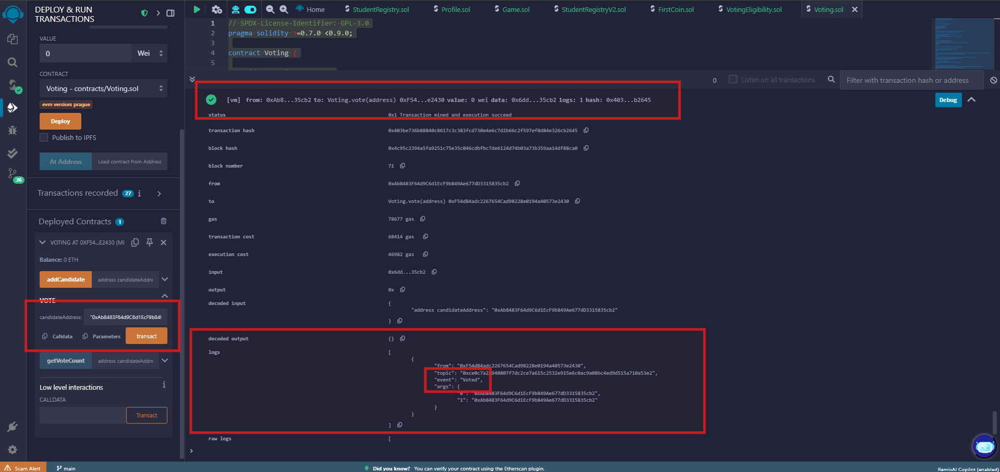
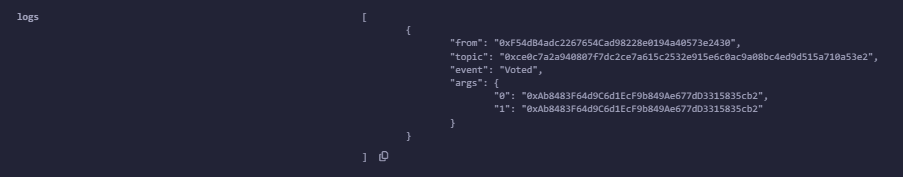
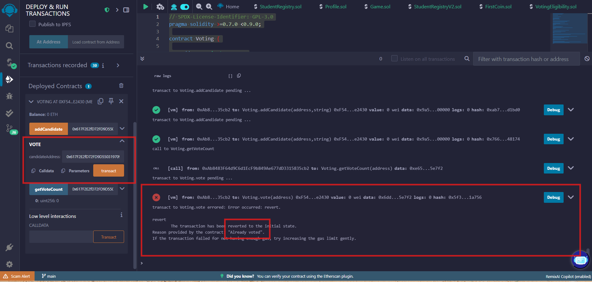
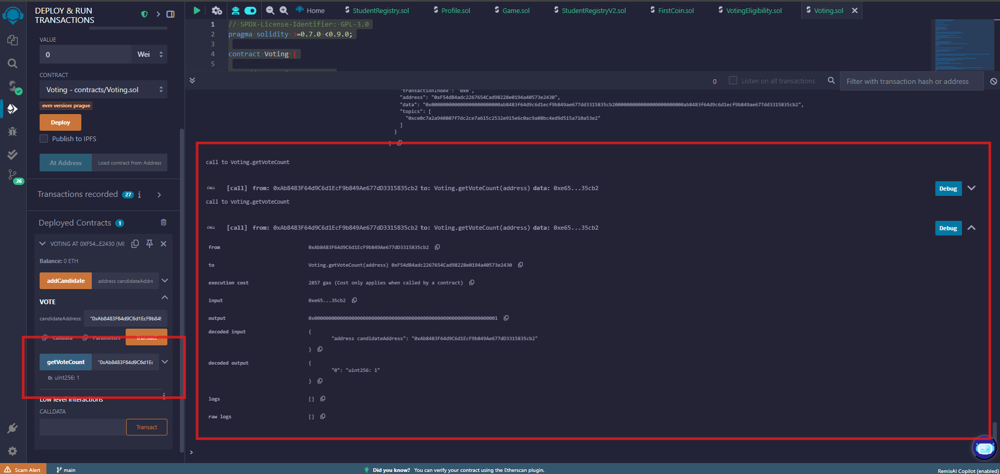

# 📘 Báo cáo bài 4.3 – Voting Smart Contract

## 🧩 Mã nguồn Smart Contract

```solidity
// SPDX-License-Identifier: GPL-3.0
pragma solidity >=0.7.0 <0.9.0;

contract Voting {

    address private owner;

    struct Candidate {
        string name;
        uint voteCount;
    }

    mapping (address => Candidate) private candidates;
    mapping (address => bool) private hasVoted;

    // modifer giới hạn quyền cho owner
    modifier isOwner() {
        require(msg.sender == owner, "Not Owner");
        _;
    }

    // modifer giới hạn lượt vote
    modifier hasNotVoted() {
        require(hasVoted[msg.sender] == false, "Already voted");
        _;
    }

    event Voted(address voter, address candidateId);

    constructor() {
        owner = msg.sender;
    }

    function addCandidate(address candidateAddress, string calldata name) external isOwner {
        candidates[candidateAddress] = Candidate(name, 0);
    }

    function vote(address candidateAddress) external hasNotVoted {
        candidates[candidateAddress].voteCount += 1; 
        hasVoted[msg.sender] = true; 

        // thông báo voted 
        emit Voted(msg.sender, candidateAddress); 
    }

    //public function để đọc số phiếu 
    function getVoteCount(address candidateAddress) external view returns (uint) {
        return candidates[candidateAddress].voteCount;
    }
}
```

---

## 💻 Cách chạy

1. Truy cập [Remix Ethereum IDE](https://remix.ethereum.org)
2. Dán mã vào tab mới `.sol`
3. Deploy contract
4. Gọi `addCandidate("Tên 1")`, `addCandidate("Tên 2")`
5. Dùng địa chỉ khác để gọi `vote(candidateId)`
6. Xem log sự kiện `Voted` trong tab "Logs" của Remix
7. Gọi `getCandidate(id)` để xem số phiếu đã được cập nhật

---

## 📸 Hình ảnh minh chứng

### ✅ Ảnh 1 – Thêm ứng viên thành công


### ✅ Ảnh 2 – Thêm ứng viên thất bại - Không phải owner theemm 


### ✅ Ảnh 3 – Gọi hàm `vote()` thành công


### ✅ Ảnh 4 – Kiểm tra sự kiện `Voted`


### ✅ Ảnh 5 – Tài khoản vote 2 lần -> Lỗi 


### ✅ Ảnh 6 – Xem số phiếu ứng viên


---
