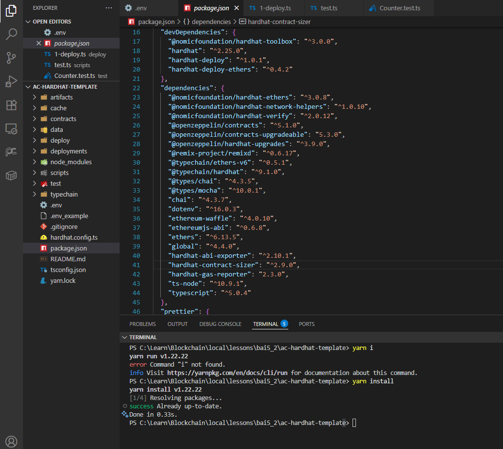
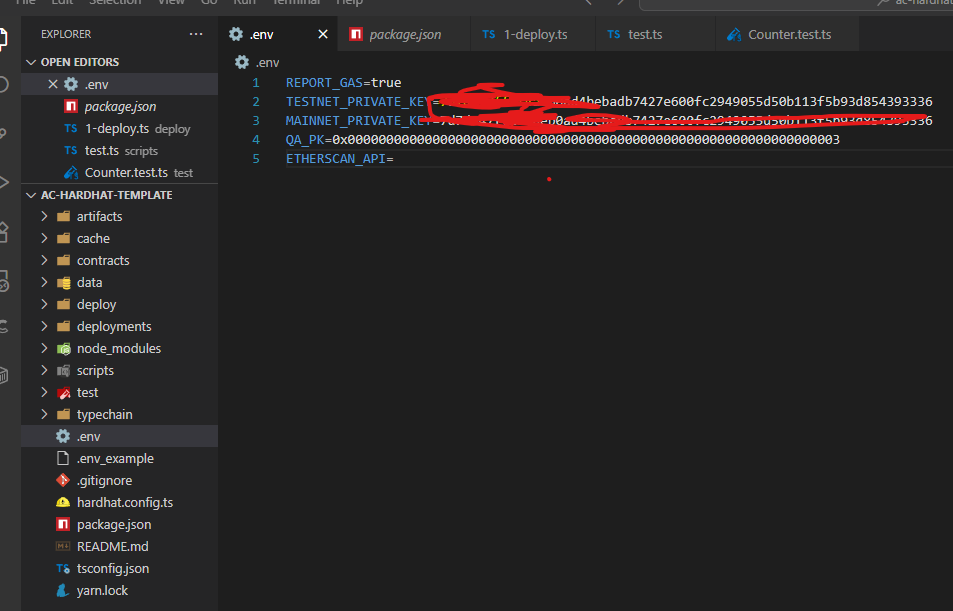
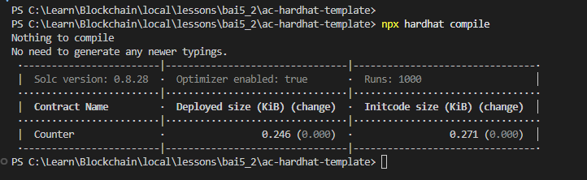
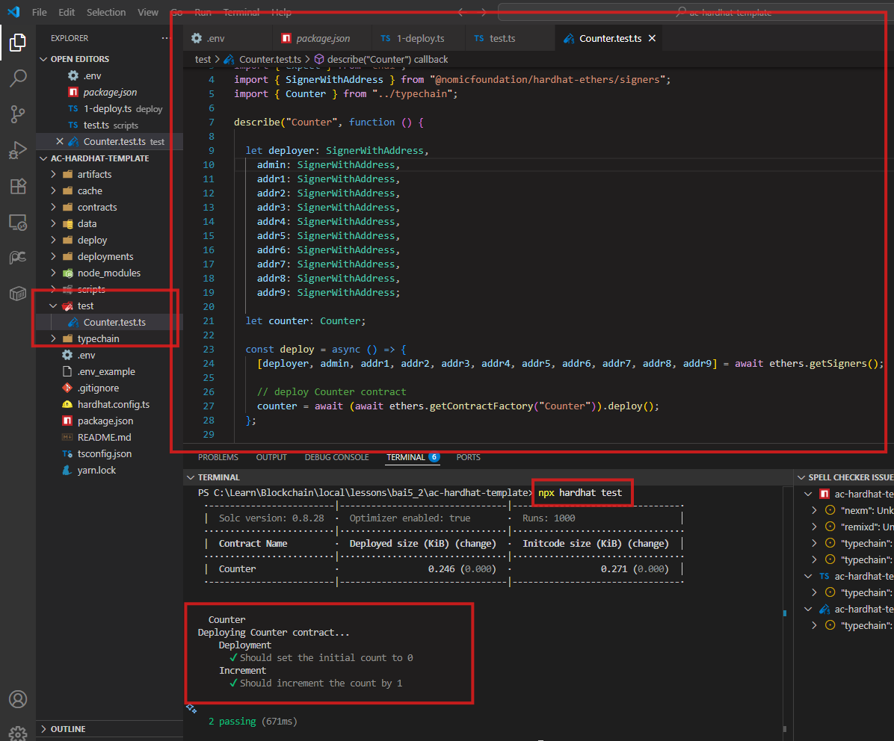
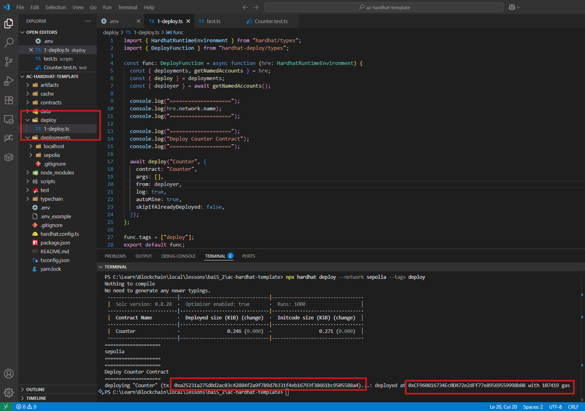
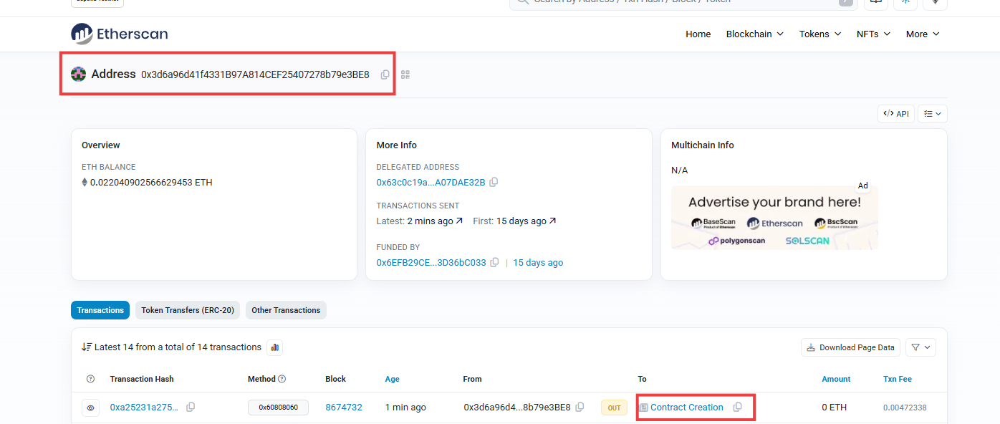
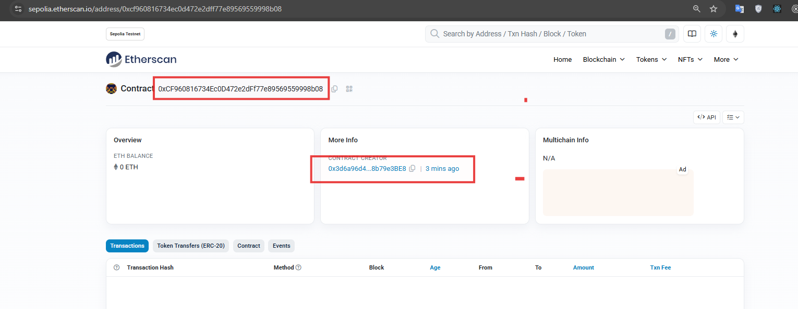
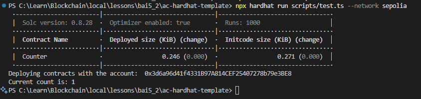
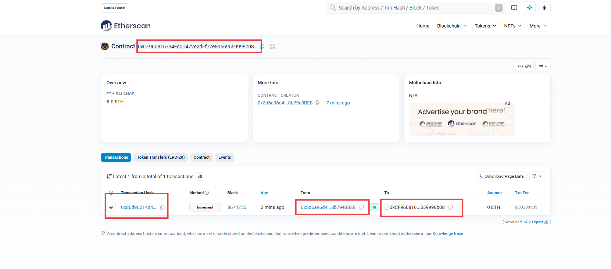
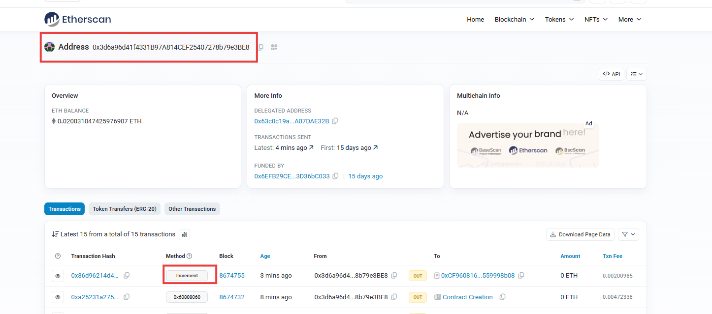

# Báo cáo 5.2 – Gửi Transaction dùng Ethers.js và Hardhat

Hướng dẫn này trình bày các bước để thiết lập, biên dịch, kiểm thử, triển khai và tương tác với smart contract bằng Ethers.js và Hardhat trên testnet Sepolia.

## 🚀 Các bước thực hiện

### 1. **Chuẩn bị môi trường**
- **Clone Repository**:
  ```bash
  git clone https://github.com/appscyclone/ac-hardhat-template.git
  ```
- **Cài đặt Dependencies**:
  ```bash
  yarn install
  ```
- **Phiên bản Node**: Đảm bảo sử dụng Node.js phiên bản > 20.0 (ví dụ: 20.11.1).
- **Biến môi trường**:
  - Tạo file `.env` trong thư mục gốc của dự án.
  - Thêm các biến sau:
    ```
    SEPOLIA_PRIVATE_KEY=<khóa_bí_mật_metamask>
    ALCHEMY_API_KEY=<khóa_api_alchemy>
    ```
  - Lấy khóa bí mật từ MetaMask và khóa API từ Alchemy.

  
  *Hình 1: Thiết lập môi trường*

  
  *Hình 2: Cấu hình biến môi trường*

### 2. **Biên dịch Contract**
- Chạy lệnh sau để biên dịch contract `Counter` và tạo artifact:
  ```bash
  npx hardhat compile
  ```

  
  *Hình 3: Biên dịch contract*

### 3. **Chạy Unit Test**
- Thực thi unit test để kiểm tra các hàm `increment()` và `getCount()` trong contract `Counter`:
  ```bash
  npx hardhat test
  ```
- Các bài kiểm tra được định nghĩa trong file `test/Counter.test.ts`.

  
  *Hình 4: Chạy unit test*

### 4. **Triển khai lên Sepolia**
- Triển khai contract `Counter` lên testnet Sepolia bằng script triển khai:
  ```bash
  npx hardhat deploy --network sepolia --tags deploy
  ```
- Script `deploy/1-deploy.ts` triển khai contract và in ra địa chỉ của contract.

  
  *Hình 5: Triển khai lên Sepolia*

  
  *Hình 6: Xác minh smart contract trên Etherscan*

  
  *Hình 7: Xác nhận smart contract trên Etherscan*

### 5. **Tương tác với Contract**
- Chạy script tương tác để gọi hàm `increment()` và lấy giá trị bộ đếm bằng `getCount()`:
  ```bash
  npx hardhat run scripts/test.ts --network sepolia
  ```
- Script `scripts/test.ts` sử dụng Ethers.js để tương tác với contract đã triển khai. Script này tăng giá trị bộ đếm và in kết quả (kết quả mong đợi: `1`).

  
  *Hình 8: Gọi hàm increment()*

  
  *Hình 9: Xác minh smart contract trên Etherscan*

  
  *Hình 10: Xác nhận smart contract trên Etherscan*

## 📚 Giải thích
- **Triển khai**: Script `1-deploy.ts` tạo và triển khai contract `Counter` lên testnet Sepolia.
- **Tương tác**: Script `test.ts` kết nối với contract đã triển khai, gọi hàm `increment()` để tăng giá trị bộ đếm và lấy giá trị bằng hàm `getCount()`.
- **Kết quả mong đợi**: Giá trị bộ đếm sẽ là `1` nếu gọi hàm `increment()` thành công.