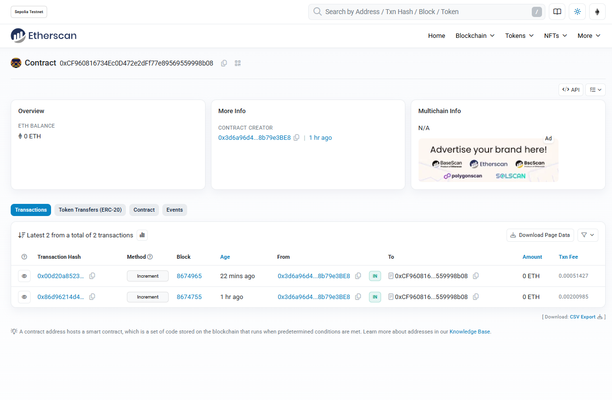
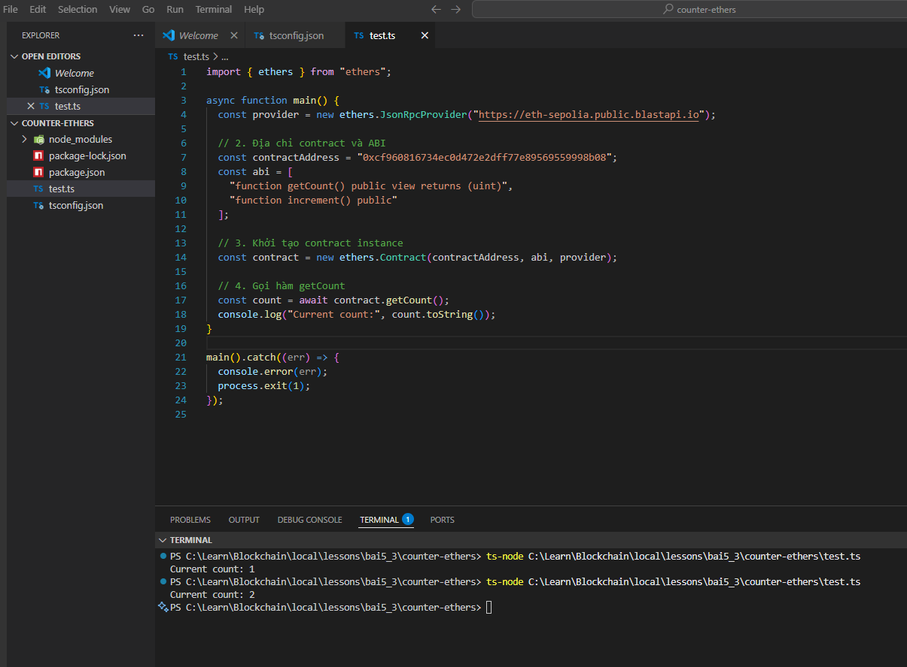

# Báo Cáo Dự Án: Gọi Contract Ethereum với Ethers.js
## 1. Chuẩn bị
Ở đây, em đã chuẩn bị một smart contract có tên là couter được deploy tại địa chỉ: 
```bash
0xCF960816734Ec0D472e2dFf77e89569559998b08
```


  *Hình 1: Chuẩn bị smart contract*

## 2. Tạo file script để kết nối tới contract 

```ts
import { ethers } from "ethers";

async function main() {
  const provider = new ethers.JsonRpcProvider("https://eth-sepolia.public.blastapi.io");

  const abi = [
    "function getCount() public view returns (uint)",
    "function increment() public"
  ];
  const contractAddress = "0xCF960816734Ec0D472e2dFf77e89569559998b08";

  const contract = new ethers.Contract(contractAddress, abi, provider);

  const count = await contract.getCount();
  console.log("Current count is:", count.toString());
}

main().catch(console.error);

```

## 3. Chạy Script
Chạy script bằng lệnh sau:

```bash
npx ts-node test.ts
```


  *Hình 2: Chạy Script*


## 4. Ghi chú thêm

Ở đây em cũng có chuẩn bị sẵn một project đã setup **Node + TypeScript** để thực thi phần script này, nằm ở folder **`counter-ethers`**.  
Mọi dependency cần thiết như `ethers`, `ts-node`, `typescript` đã được cài đặt


