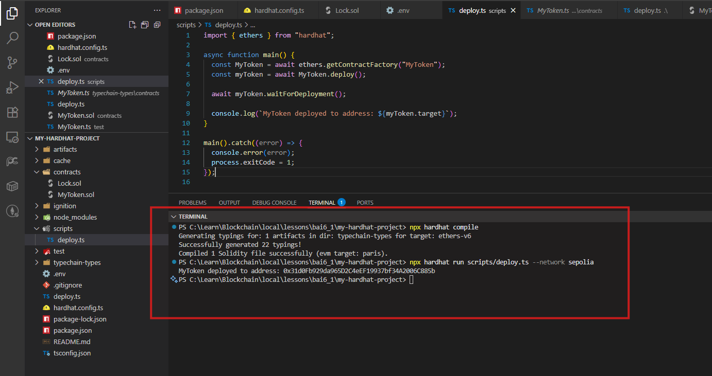
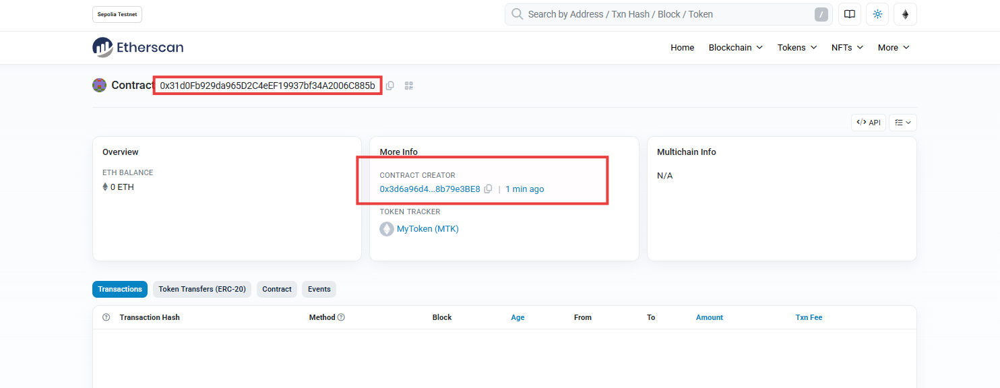
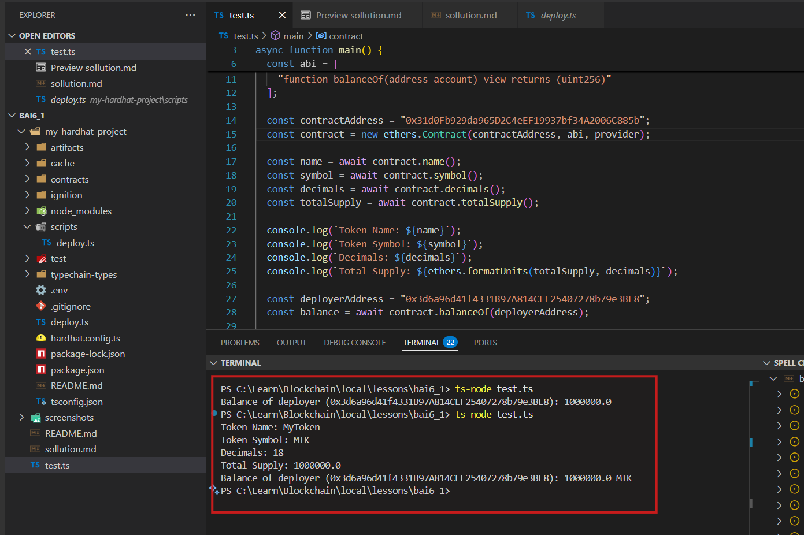

# 📈 MyToken ERC20 - Bài tập Solidity

Dự án triển khai token ERC20 tên `MyToken` (MTK) với tổng cung 1,000,000 token, toàn bộ được mint cho deployer.

---

## 📜 Mã Contract

### **MyToken.sol**

```solidity
// SPDX-License-Identifier: MIT
pragma solidity ^0.8.20;

import "@openzeppelin/contracts/token/ERC20/ERC20.sol";

contract MyToken is ERC20 {
    constructor() ERC20("MyToken", "MTK") {
        _mint(msg.sender, 1000000 * 10 ** decimals());
    }
}
```

---

## 📁 Source code (./my-hardhat-project)

```
my-hardhat-project/
├── contracts/
│   └── MyToken.sol
├── scripts/
│   └── deploy.ts
├── hardhat.config.ts
├── package.json
├── tsconfig.json
└── ...
```

---

## 🚀 Cài đặt & triển khai

### **Yêu cầu**
- Node.js, npm
- Hardhat
- Tài khoản ví với Sepolia ETH

### **Lệnh biên dịch & triển khai**

```bash
npx hardhat compile
npx hardhat run scripts/deploy.ts --network sepolia
```

#### **Kết quả biên dịch**


#### **Kết quả triển khai**


---

## 🧪 Kiểm tra hợp đồng

### **Script kiểm tra** (`test.ts`)

```typescript
import { ethers } from "ethers";

async function main() {
  const provider = new ethers.JsonRpcProvider("https://eth-sepolia.public.blastapi.io");
  const abi = [
    "function name() view returns (string)",
    "function symbol() view returns (string)",
    "function decimals() view returns (uint8)",
    "function totalSupply() view returns (uint256)",
    "function balanceOf(address account) view returns (uint256)"
  ];
  const contractAddress = "0x31d0Fb929da965D2C4eEF19937bf34A2006C885b";
  const contract = new ethers.Contract(contractAddress, abi, provider);

  const name = await contract.name();
  const symbol = await contract.symbol();
  const decimals = await contract.decimals();
  const totalSupply = await contract.totalSupply();
  const deployerAddress = "0x3d6a96d41f4331B97A814CEF25407278b79e3BE8";
  const balance = await contract.balanceOf(deployerAddress);

  console.log(`Token Name: ${name}`);
  console.log(`Token Symbol: ${symbol}`);
  console.log(`Decimals: ${decimals}`);
  console.log(`Total Supply: ${ethers.formatUnits(totalSupply, decimals)}`);
  console.log(`Balance of deployer (${deployerAddress}): ${ethers.formatUnits(balance, decimals)} ${symbol}`);
}

main().catch(console.error);
```

#### **Kết quả kiểm tra**


---

🎉 **Hoàn thành!**