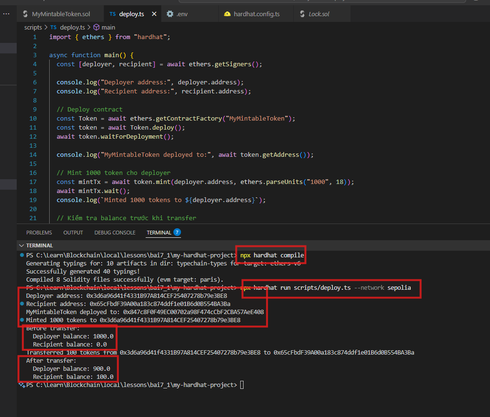

# Bài Tập 7.1 – Mint Token ERC20

🎯 **Mục tiêu:**
- Viết, deploy và mint token ERC20 bằng Hardhat trên mạng Sepolia testnet.

---

## ✅ Yêu cầu

1. **Viết contract `MyMintableToken`:**
   - Kế thừa `ERC20` từ OpenZeppelin.
   - Sử dụng `Ownable` để giới hạn quyền mint.
   - Hàm `mint(address to, uint amount)` chỉ cho `owner` gọi, thực hiện mint token.

2. **Viết script deploy:**
   - Deploy contract lên Sepolia.
   - Mint 1000 token cho `deployer`.
   - In số dư (balance) của `deployer`.

3. **Transfer:**
   - Thực hiện gửi 100 token từ `deployer` cho `recipient`.
   - In lại balance của cả hai.

---

## 📝 Nội dung file Solidity

**contracts/MyMintableToken.sol**
```solidity
// SPDX-License-Identifier: MIT
pragma solidity ^0.8.0;

import "@openzeppelin/contracts/token/ERC20/ERC20.sol";
import "@openzeppelin/contracts/access/Ownable.sol";

contract MyMintableToken is ERC20, Ownable {
    constructor() ERC20("MyMintableToken", "MMT") Ownable(msg.sender) {}

    function mint(address to, uint amount) public onlyOwner {
        _mint(to, amount);
    }
}
```

---

## 🚀 Script Hardhat

**scripts/deploy.ts**

```typescript
import { ethers } from "hardhat";

async function main() {
    const [deployer, recipient] = await ethers.getSigners();

    console.log("Deployer address:", deployer.address);
    console.log("Recipient address:", recipient.address);

    // Deploy contract
    const Token = await ethers.getContractFactory("MyMintableToken");
    const token = await Token.deploy();
    await token.waitForDeployment();

    console.log("MyMintableToken deployed to:", await token.getAddress());

    // Mint 1000 token cho deployer
    const mintTx = await token.mint(deployer.address, ethers.parseUnits("1000", 18));
    await mintTx.wait();
    console.log(`Minted 1000 tokens to ${deployer.address}`);

    // In balance trước khi transfer
    let deployerBalance = await token.balanceOf(deployer.address);
    let recipientBalance = await token.balanceOf(recipient.address);

    console.log(`Before transfer:`);
    console.log(`  Deployer balance: ${ethers.formatUnits(deployerBalance, 18)}`);
    console.log(`  Recipient balance: ${ethers.formatUnits(recipientBalance, 18)}`);

    // Transfer 100 token cho recipient
    const transferTx = await token.transfer(recipient.address, ethers.parseUnits("100", 18));
    await transferTx.wait();
    console.log(`Transferred 100 tokens from ${deployer.address} to ${recipient.address}`);

    // In balance sau transfer
    deployerBalance = await token.balanceOf(deployer.address);
    recipientBalance = await token.balanceOf(recipient.address);

    console.log(`After transfer:`);
    console.log(`  Deployer balance: ${ethers.formatUnits(deployerBalance, 18)}`);
    console.log(`  Recipient balance: ${ethers.formatUnits(recipientBalance, 18)}`);
}

main().catch((error) => {
    console.error(error);
    process.exitCode = 1;
});
```

---

## 🧪 Chạy lệnh

### 🔨 Compile contract
```bash
npx hardhat compile
```

---

### 🚀 Deploy & mint trên Sepolia
```bash
npx hardhat run scripts/deploy.ts --network sepolia
```

---

## 🧪 Chạy lệnh

```bash
npx hardhat deploy --network sepolia --tags deploy
```

## **Kết quả biên dịch**


#### **Kết quả triển khai**


---