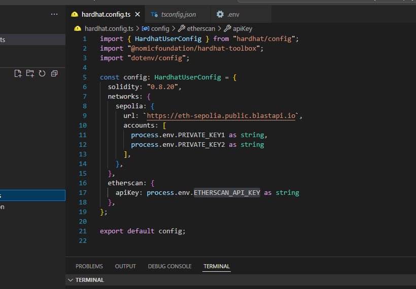
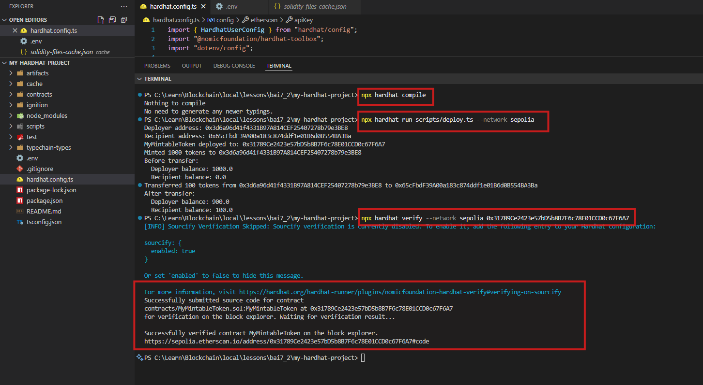

# 📝 Bài Tập 7.2 – Verify MyMintableToken trên Etherscan

## 🎯 Mục tiêu
- Deploy contract ERC20 `MyMintableToken` lên mạng Sepolia.
- Verify contract trên Etherscan.

---

## ✅ Các bước đã thực hiện

### 🔨 Bước 1 – Cài đặt plugin verify
```bash
npm install --save-dev @nomicfoundation/hardhat-verify
```

### ⚙ Bước 2 – Cấu hình hardhat.config.ts
```typescript
import "@nomicfoundation/hardhat-verify";
import { HardhatUserConfig } from "hardhat/config";
import "@nomicfoundation/hardhat-toolbox";
import "dotenv/config";

const config: HardhatUserConfig = {
  networks: {
    sepolia: {
      url: `https://sepolia.infura.io/v3/${process.env.INFURA_API_KEY}`,
      accounts: [`0x${process.env.PRIVATE_KEY}`]
    }
  },
  etherscan: {
    apiKey: process.env.ETHERSCAN_API_KEY
  },
  solidity: "0.8.20",
};

export default config;
```

(⚠ Private key, API key được lưu trong file `.env` không commit lên git.)

## **Config hardhat project**


---

### 🚀 Bước 3 – Deploy contract và Verify contract
```bash
npx hardhat run scripts/deploy.ts --network sepolia
```
Output:
```
MyMintableToken deployed to: 0x31789Ce2423e57bD5b8B7F6c78E01CCD0c67F6A7
```
(Địa chỉ contract này đã được lưu để verify.)

## **Config hardhat project**


```bash
npx hardhat verify --network sepolia 0x31789Ce2423e57bD5b8B7F6c78E01CCD0c67F6A7
```
Output verify thành công:
```
Successfully verified contract MyMintableToken on the block explorer.
https://sepolia.etherscan.io/address/0x31789Ce2423e57bD5b8B7F6c78E01CCD0c67F6A7#code
```

---

### ✅ Bước 5 – Kiểm tra trên Etherscan
- Source code đã được verify, hiển thị công khai trên tab **Contract**.
- Có thể xem các hàm trên tab `Read Contract` và `Write Contract`.

## **Config hardhat project**


---

## 🎯 Nộp bài

- **Địa chỉ contract:**  
```
0x31789c2423e57bD5b88F76c78E01CCD0c67F6A7
```

- **Link verify trên Etherscan:**  
[https://sepolia.etherscan.io/address/0x31789c2423e57bD5b88F76c78E01CCD0c67F6A7#code](https://sepolia.etherscan.io/address/0x31789Ce2423e57bD5b8B7F6c78E01CCD0c67F6A7#code)

- **Screenshot verify thành công:**  
(Đính kèm từ hình đã chụp:  
✅ Hardhat terminal verify success và  
✅ Etherscan hiển thị Contract Source Code Verified)

---

🎉 **Hoàn thành Bài Tập 7.2!**
